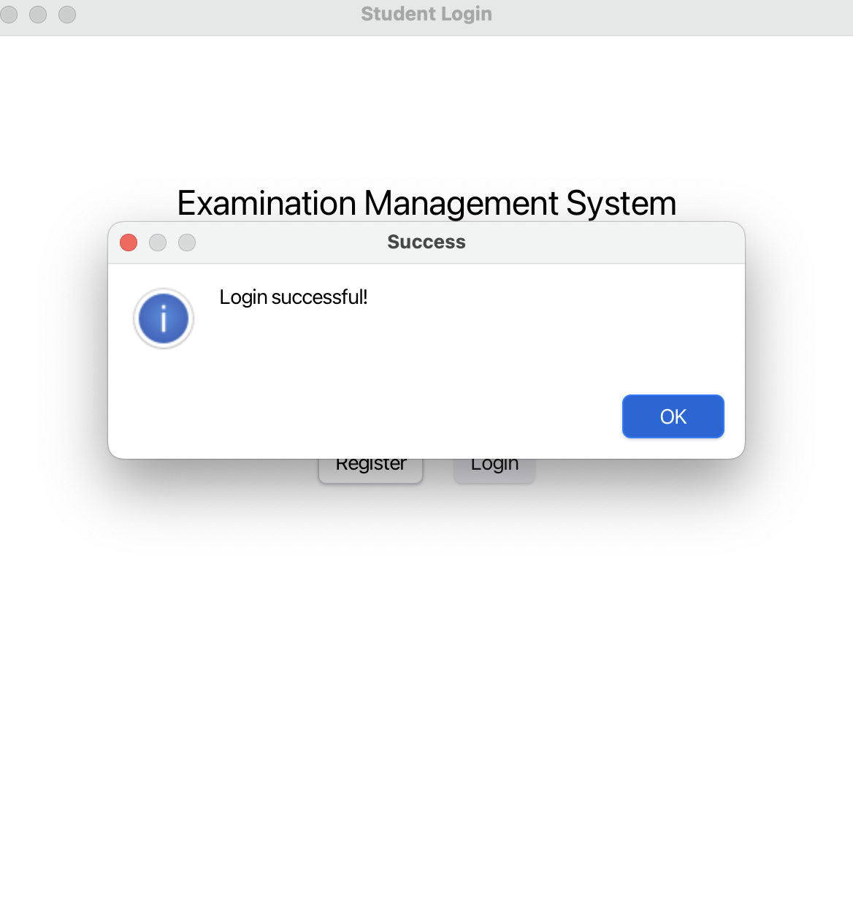
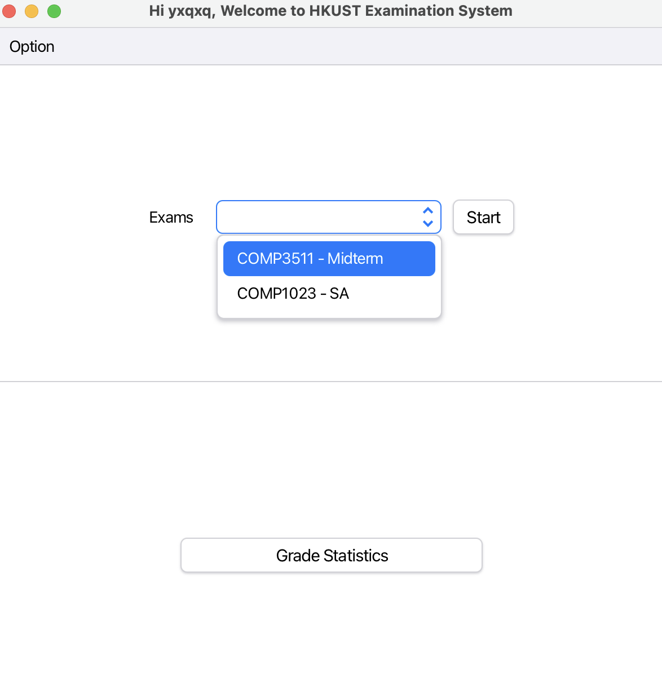
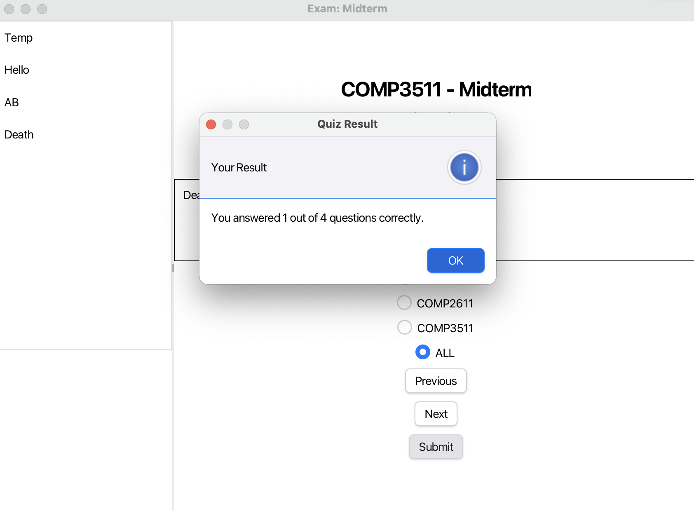
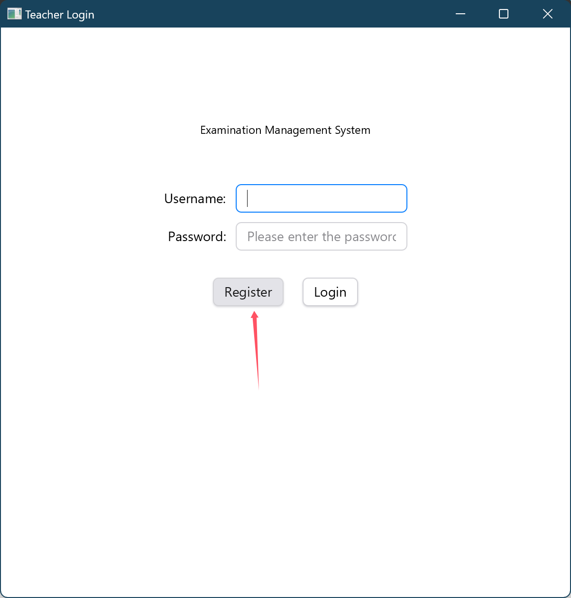
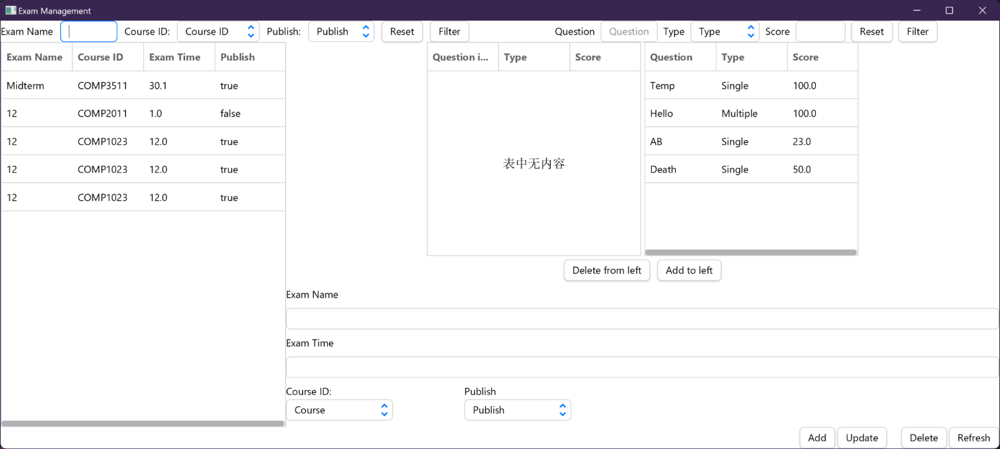
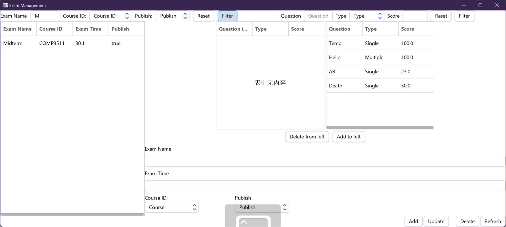
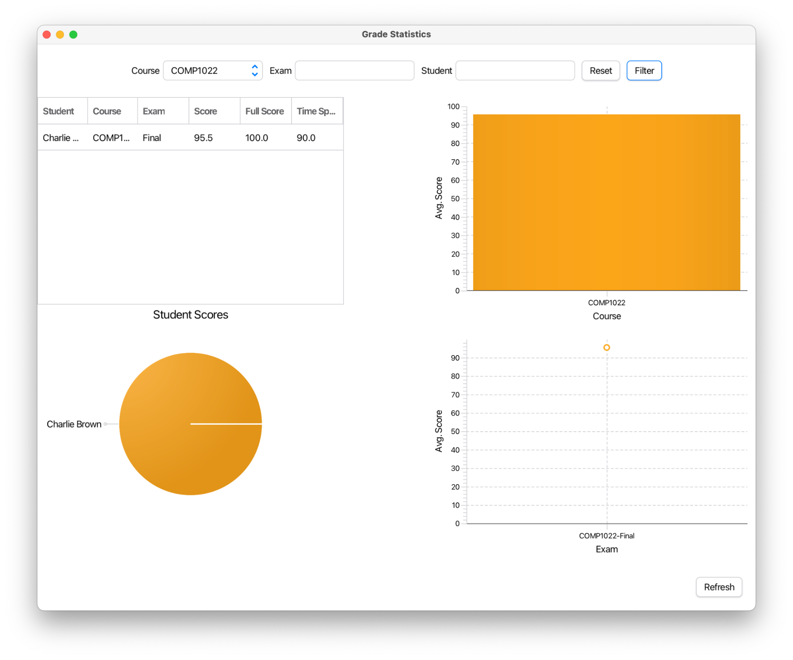
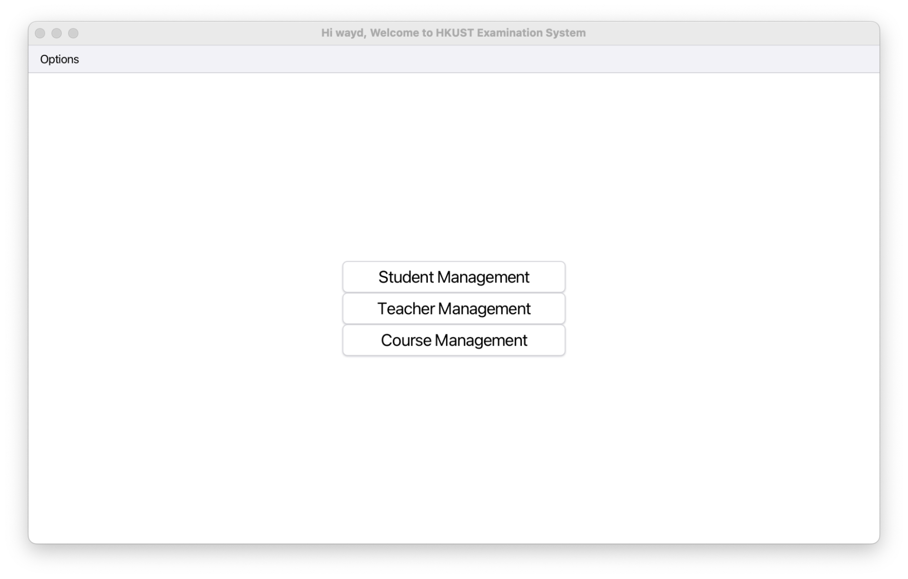

# COMP3111-Project

## Team Information

| Team ID | Member           | Email ID | GitHub ID | Dev Branch ID | Task  |
|---------|------------------|----------|-----------|---------------|-------|
| 9       | CHAN, Wing Yu    | wychancf | waydxd    | Task3         | Task3 |
| 9       | IU, Hei Ching    | hciu     | yxqxq     | Task1         | Task1 |
| 9       | YE, Weicheng     | wyeam    | EZEROR    | Task2         | Task2 |

## Project Overview

This project is a comprehensive exam management system developed as part of the COMP3111 course. The system allows for the management of exams, grades, and user accounts, including teachers and students. The project utilizes various technologies and frameworks to achieve its functionality.

## Technologies and Frameworks Used

### Java
The primary programming language used for the development of the project. Java is used for implementing the core logic, services, and controllers of the application.

### Maven
Maven is used as the build automation tool for the project. It manages project dependencies, builds the project, and runs tests.

### SQLite
SQLite is used as the database for storing all the data related to exams, grades, and user accounts. It is a lightweight, file-based database that is easy to set up and use.

### JOOQ
JOOQ (Java Object Oriented Querying) is used as the database access library. It provides a fluent API for typesafe SQL query construction and execution. JOOQ helps in generating SQL queries and mapping the results to Java objects.

### JavaFX
JavaFX is used for building the graphical user interface (GUI) of the application. It provides a rich set of UI controls and features for developing desktop applications.

### JUnit
JUnit is used for writing and running unit tests. It helps in ensuring the correctness of the code by providing a framework for writing repeatable tests.

### Mockito
Mockito is used for mocking dependencies in unit tests. It allows for the creation of mock objects and the definition of their behavior, which helps in isolating the code under test.

## Project Structure

The project is organized into the following main packages:

- `comp3111.examsystem.controller`: Contains the controllers for handling user interactions and managing the flow of the application.
- `comp3111.examsystem.dao`: Contains the Data Access Object (DAO) classes for interacting with the database.
- `comp3111.examsystem.entity`: Contains the entity classes representing the data models.
- `comp3111.examsystem.service`: Contains the service classes that implement the business logic of the application.
- `com.examsystem.jooq.generated`: Contains the JOOQ generated code allowing DAO classes to interact with our SQLite database.

## How to Run the Project

1. **Clone the repository**:
   ```sh
   git clone https://github.com/waydxd/COMP3111-Project.git
   cd COMP3111-Project
   ```

2. **Build the project using Maven**:
   ```sh
   mvn clean install
   ```

3. **Run the application**:
   ```sh
   mvn javafx:run
   ```

## How to Run Tests

To run the tests, use the following Maven command:
```sh
mvn test
```

Note that the tests only fully covered `comp3111.examsystem.dao`, `comp3111.examsystem.entity`, `comp3111.examsystem.service`. `comp3111.examsystem.controller` is partially covered but will give out errors during build. However, we are required to test data-related logics only. Therefore, we decided not to include the controller tests in our coverage report.

`com.examsystem.jooq.generated` is not tested as it is generated by JOOQ.

## Git commit log
[git_log.txt](git_log.txt)

## Coverage Report
[index.html](htmlReport/index.html)

## JavaDoc
[index.html](javadocs/index.html)

## Screenshots
<html>
  <head>
    <meta content="text/html; charset=UTF-8" http-equiv="content-type" />
  </head>
  <body class="c13 doc-content">
    <div>
      <p class="c2 c8"><span class="c1"></span></p>
    </div>
    <p class="c12 subtitle" id="h.cr52oen6jr4r">
      <span class="c7 c9">Team 9</span>
    </p>
    <p class="c2 c14"><span class="c10">&#12289;</span></p>
    <p class="c2 c8"><span class="c3"></span></p>
    <p class="c4 title" id="h.vwk5ut6lj0r5">
      <span class="c17">Screenshots</span>
    </p>
    <p class="c4 title" id="h.9e3me1ey1q7w">
      <span class="c10 c15">Task 1: Student Portal</span>
    </p>
    <p class="c4 title" id="h.6z8x33m6tsbe">
      <span class="c9 c10 c11"
        >Task 1.1: Student Registration &amp; Login &nbsp;</span
      >
    </p>
    <p class="c2"><span>Select Student Login</span></p>
    <p class="c2">
      <span
        style="
          overflow: hidden;
          display: inline-block;
          margin: 0px 0px;
          border: 0px solid #000000;
          transform: rotate(0rad) translateZ(0px);
          -webkit-transform: rotate(0rad) translateZ(0px);
          width: 467.91px;
          height: 367.08px;
        "
        ></span>
    </p>
    <p class="c2">
      <span
        style="
          overflow: hidden;
          display: inline-block;
          margin: 0px 0px;
          border: 0px solid #000000;
          transform: rotate(0rad) translateZ(0px);
          -webkit-transform: rotate(0rad) translateZ(0px);
          width: 445.5px;
          height: 297px;
        "
        ></span>
    </p>
    <p class="c2 c8"><span class="c1"></span></p>
    <p class="c2 c8"><span class="c1"></span></p>
    <p class="c2"><span class="c1">Select Register: </span></p>
    <p class="c2">
      <span
        style="
          overflow: hidden;
          display: inline-block;
          margin: 0px 0px;
          border: 0px solid #000000;
          transform: rotate(0rad) translateZ(0px);
          -webkit-transform: rotate(0rad) translateZ(0px);
          width: 445.85px;
          height: 424.1px;
        "
        ></span>
    </p>
    <p class="c2 c8"><span class="c1"></span></p>
    <p class="c2">
      <span class="c1">Fill in credentials &amp; click Register: </span>
    </p>
    <p class="c2">
      <span
        style="
          overflow: hidden;
          display: inline-block;
          margin: 0px 0px;
          border: 0px solid #000000;
          transform: rotate(0rad) translateZ(0px);
          -webkit-transform: rotate(0rad) translateZ(0px);
          width: 397.7px;
          height: 417.5px;
        "
        ></span>
    </p>
    <p class="c2">
      <span>Fill in login credentials: <br /></span
      ><span
        style="
          overflow: hidden;
          display: inline-block;
          margin: 0px 0px;
          border: 0px solid #000000;
          transform: rotate(0rad) translateZ(0px);
          -webkit-transform: rotate(0rad) translateZ(0px);
          width: 602px;
          height: 405.6px;
        "
        ></span>
    </p>
    <p class="c2 c8"><span class="c1"></span></p>
    <p class="c2"><span class="c1">Click Login: </span></p>
    <p class="c2">
      <span
        style="
          overflow: hidden;
          display: inline-block;
          margin: 0px 0px;
          border: 0px solid #000000;
          transform: rotate(0rad) translateZ(0px);
          -webkit-transform: rotate(0rad) translateZ(0px);
          width: 602px;
          height: 452px;
        "
        ></span>
    </p>
    <p class="c2"><span class="c1">Click OK and head to main page:</span></p>
    <p class="c2">
      <span>&nbsp;</span
      ><span
        style="
          overflow: hidden;
          display: inline-block;
          margin: 0px 0px;
          border: 0px solid #000000;
          transform: rotate(0rad) translateZ(0px);
          -webkit-transform: rotate(0rad) translateZ(0px);
          width: 472.42px;
          height: 499.1px;
        "
        ></span>
    </p>
    <p class="c0 title" id="h.4ag9s9mj4nu0"><span class="c9 c10 c11"></span></p>
    <p class="c2 c8"><span class="c1"></span></p>
    <p class="c2 c8"><span class="c1"></span></p>
    <p class="c2 c8"><span class="c1"></span></p>
    <p class="c0 title" id="h.5h0qnmddod4f"><span class="c9 c10 c11"></span></p>
    <p class="c0 title" id="h.vueh7t77u77a"><span class="c9 c10 c11"></span></p>
    <p class="c2 c8"><span class="c1"></span></p>
    <p class="c2 c8"><span class="c1"></span></p>
    <p class="c2 c8"><span class="c1"></span></p>
    <p class="c2 c8"><span class="c1"></span></p>
    <p class="c2 c8"><span class="c1"></span></p>
    <p class="c0 title" id="h.isx63mxfvzy8"><span class="c9 c10 c11"></span></p>
    <p class="c0 title" id="h.tcvimagy1bz3"><span class="c9 c10 c11"></span></p>
    <p class="c2 c8"><span class="c1"></span></p>
    <p class="c4 title" id="h.trlia02svoyq">
      <span class="c9 c10 c11">Task 1.2: Student Examination</span>
    </p>
    <p class="c2"><span class="c1">Select exam: </span></p>
    <p class="c2">
      <span
        style="
          overflow: hidden;
          display: inline-block;
          margin: 0px 0px;
          border: 0px solid #000000;
          transform: rotate(0rad) translateZ(0px);
          -webkit-transform: rotate(0rad) translateZ(0px);
          width: 396.29px;
          height: 419.84px;
        "
        ></span>
    </p>
    <p class="c2">
      <span
        style="
          overflow: hidden;
          display: inline-block;
          margin: 0px 0px;
          border: 0px solid #000000;
          transform: rotate(0rad) translateZ(0px);
          -webkit-transform: rotate(0rad) translateZ(0px);
          width: 404.51px;
          height: 426.5px;
        "
        ></span>
    </p>
    <p class="c2">
      <span class="c1"
        >Click Start to head to start page of the selected exam:
      </span>
    </p>
    <p class="c2">
      <span
        style="
          overflow: hidden;
          display: inline-block;
          margin: 0px 0px;
          border: 0px solid #000000;
          transform: rotate(0rad) translateZ(0px);
          -webkit-transform: rotate(0rad) translateZ(0px);
          width: 356.56px;
          height: 376.1px;
        "
        ></span>
    </p>
    <p class="c2">
      <span class="c1">Click Start Exam to head to exam page: </span>
    </p>
    <p class="c2">
      <span
        style="
          overflow: hidden;
          display: inline-block;
          margin: 0px 0px;
          border: 0px solid #000000;
          transform: rotate(0rad) translateZ(0px);
          -webkit-transform: rotate(0rad) translateZ(0px);
          width: 502.5px;
          height: 371.45px;
        "
        ></span>
    </p>
    <p class="c2 c8"><span class="c1"></span></p>
    <p class="c2 c8"><span class="c1"></span></p>
    <p class="c2 c8"><span class="c1"></span></p>
    <p class="c2 c8"><span class="c1"></span></p>
    <p class="c2 c8"><span class="c1"></span></p>
    <p class="c2 c8"><span class="c1"></span></p>
    <p class="c2">
      <span class="c1">Click Next to go to next question: </span>
    </p>
    <p class="c2">
      <span
        style="
          overflow: hidden;
          display: inline-block;
          margin: 0px 0px;
          border: 0px solid #000000;
          transform: rotate(0rad) translateZ(0px);
          -webkit-transform: rotate(0rad) translateZ(0px);
          width: 473.5px;
          height: 349.43px;
        "
        ></span>
    </p>
    <p class="c2 c8"><span class="c1"></span></p>
    <p class="c2 c8"><span class="c1"></span></p>
    <p class="c2">
      <span class="c1">Click Previous to go to previous question: </span>
    </p>
    <p class="c2">
      <span
        style="
          overflow: hidden;
          display: inline-block;
          margin: 0px 0px;
          border: 0px solid #000000;
          transform: rotate(0rad) translateZ(0px);
          -webkit-transform: rotate(0rad) translateZ(0px);
          width: 439.94px;
          height: 322.28px;
        "
        ></span>
    </p>
    <p class="c2 c8"><span class="c1"></span></p>
    <p class="c2 c8"><span class="c1"></span></p>
    <p class="c2 c8"><span class="c1"></span></p>
    <p class="c2 c8"><span class="c1"></span></p>
    <p class="c2 c8"><span class="c1"></span></p>
    <p class="c2 c8"><span class="c1"></span></p>
    <p class="c2 c8"><span class="c1"></span></p>
    <p class="c2 c8"><span class="c1"></span></p>
    <p class="c2"><span class="c1">Select answers and submit quiz: </span></p>
    <p class="c2">
      <span
        style="
          overflow: hidden;
          display: inline-block;
          margin: 0px 0px;
          border: 0px solid #000000;
          transform: rotate(0rad) translateZ(0px);
          -webkit-transform: rotate(0rad) translateZ(0px);
          width: 473.63px;
          height: 350.1px;
        "
        ></span>
    </p>
    <p class="c2"><span class="c1">Click Submit and view results: </span></p>
    <p class="c2">
      <span
        style="
          overflow: hidden;
          display: inline-block;
          margin: 0px 0px;
          border: 0px solid #000000;
          transform: rotate(0rad) translateZ(0px);
          -webkit-transform: rotate(0rad) translateZ(0px);
          width: 549.9px;
          height: 404.93px;
        "
        ></span>
    </p>
    <p class="c2">
      <span>Click Start Exam again for the same exam: </span
      ><span
        style="
          overflow: hidden;
          display: inline-block;
          margin: 0px 0px;
          border: 0px solid #000000;
          transform: rotate(0rad) translateZ(0px);
          -webkit-transform: rotate(0rad) translateZ(0px);
          width: 601.7px;
          height: 446.67px;
        "
        ></span>
    </p>
    <p class="c0 title" id="h.o822qbt3nj03"><span class="c9 c10 c11"></span></p>
    <p class="c0 title" id="h.riqyfw71tkbu"><span class="c9 c10 c11"></span></p>
    <p class="c0 title" id="h.49beb1fg5744"><span class="c9 c10 c11"></span></p>
    <p class="c0 title" id="h.c3q0wy50d287"><span class="c9 c10 c11"></span></p>
    <p class="c2 c8"><span class="c1"></span></p>
    <p class="c2 c8"><span class="c1"></span></p>
    <p class="c2 c8"><span class="c1"></span></p>
    <p class="c2 c8"><span class="c1"></span></p>
    <p class="c2 c8"><span class="c1"></span></p>
    <p class="c2 c8"><span class="c1"></span></p>
    <p class="c2 c8"><span class="c1"></span></p>
    <p class="c0 title" id="h.vgnfucm6g37v"><span class="c9 c10 c11"></span></p>
    <p class="c2 c8"><span class="c1"></span></p>
    <p class="c2 c8"><span class="c1"></span></p>
    <p class="c2 c8"><span class="c1"></span></p>
    <p class="c2 c8"><span class="c1"></span></p>
    <p class="c4 title" id="h.6ulr7fu3qc5d">
      <span class="c9 c10 c11">Task 1.3: Student Grade Statistics </span>
    </p>
    <p class="c2"><span class="c1">Click on Grade Statistics:</span></p>
    <p class="c2">
      <span>&nbsp;</span
      ><span
        style="
          overflow: hidden;
          display: inline-block;
          margin: 0px 0px;
          border: 0px solid #000000;
          transform: rotate(0rad) translateZ(0px);
          -webkit-transform: rotate(0rad) translateZ(0px);
          width: 410.43px;
          height: 428.84px;
        "
        ></span>
    </p>
    <p class="c2">
      <span>View all exams taken for logged in student: <br /></span
      ><span
        style="
          overflow: hidden;
          display: inline-block;
          margin: 0px 0px;
          border: 0px solid #000000;
          transform: rotate(0rad) translateZ(0px);
          -webkit-transform: rotate(0rad) translateZ(0px);
          width: 558.53px;
          height: 474.1px;
        "
        ></span>
    </p>
    <p class="c4 title" id="h.40rdhyagv7xp">
      <span class="c9 c10 c11">Task 2: Teacher Portal</span>
    </p>
    <p class="c4 title" id="h.mvob8d7pvfa2">
      <span class="c6">TASK 2.1: Handling the teacher&#39;s login</span>
    </p>
    <p class="c2">
      <span
        style="
          overflow: hidden;
          display: inline-block;
          margin: 0px 0px;
          border: 0px solid #000000;
          transform: rotate(0rad) translateZ(0px);
          -webkit-transform: rotate(0rad) translateZ(0px);
          width: 552.5px;
          height: 435.94px;
        "
        ></span
      ><span
        style="
          overflow: hidden;
          display: inline-block;
          margin: 0px 0px;
          border: 0px solid #000000;
          transform: rotate(0rad) translateZ(0px);
          -webkit-transform: rotate(0rad) translateZ(0px);
          width: 601.7px;
          height: 629.33px;
        "
        ></span
      ><span
        style="
          overflow: hidden;
          display: inline-block;
          margin: 0px 0px;
          border: 0px solid #000000;
          transform: rotate(0rad) translateZ(0px);
          -webkit-transform: rotate(0rad) translateZ(0px);
          width: 601.7px;
          height: 369.33px;
        "
        ></span>
    </p>
    <p class="c4 title" id="h.j7h6d2m47xmq">
      <span class="c6">TASK 2.2: Handling the teacher&#39;s registration</span>
    </p>
    <p class="c2">
      <span
        style="
          overflow: hidden;
          display: inline-block;
          margin: 0px 0px;
          border: 0px solid #000000;
          transform: rotate(0rad) translateZ(0px);
          -webkit-transform: rotate(0rad) translateZ(0px);
          width: 552.5px;
          height: 435.94px;
        "
        ></span
      ><span
        style="
          overflow: hidden;
          display: inline-block;
          margin: 0px 0px;
          border: 0px solid #000000;
          transform: rotate(0rad) translateZ(0px);
          -webkit-transform: rotate(0rad) translateZ(0px);
          width: 601.7px;
          height: 629.33px;
        "
        ></span
      ><span
        style="
          overflow: hidden;
          display: inline-block;
          margin: 0px 0px;
          border: 0px solid #000000;
          transform: rotate(0rad) translateZ(0px);
          -webkit-transform: rotate(0rad) translateZ(0px);
          width: 601.7px;
          height: 629.33px;
        "
        ></span
      ><span
        style="
          overflow: hidden;
          display: inline-block;
          margin: 0px 0px;
          border: 0px solid #000000;
          transform: rotate(0rad) translateZ(0px);
          -webkit-transform: rotate(0rad) translateZ(0px);
          width: 601.7px;
          height: 629.33px;
        "
        ></span
      ><span
        style="
          overflow: hidden;
          display: inline-block;
          margin: 0px 0px;
          border: 0px solid #000000;
          transform: rotate(0rad) translateZ(0px);
          -webkit-transform: rotate(0rad) translateZ(0px);
          width: 601.7px;
          height: 629.33px;
        "
        ></span
      ><span
        style="
          overflow: hidden;
          display: inline-block;
          margin: 0px 0px;
          border: 0px solid #000000;
          transform: rotate(0rad) translateZ(0px);
          -webkit-transform: rotate(0rad) translateZ(0px);
          width: 601.7px;
          height: 369.33px;
        "
        ></span>
    </p>
    <p class="c4 title" id="h.uei81staajp8">
      <span class="c6"
        >TASK 2.3: Implementing the Question Bank Management</span
      >
    </p>
    <p class="c2">
      <span
        style="
          overflow: hidden;
          display: inline-block;
          margin: 0px 0px;
          border: 0px solid #000000;
          transform: rotate(0rad) translateZ(0px);
          -webkit-transform: rotate(0rad) translateZ(0px);
          width: 601.7px;
          height: 369.33px;
        "
        ></span
      ><span
        style="
          overflow: hidden;
          display: inline-block;
          margin: 0px 0px;
          border: 0px solid #000000;
          transform: rotate(0rad) translateZ(0px);
          -webkit-transform: rotate(0rad) translateZ(0px);
          width: 601.7px;
          height: 314.67px;
        "
        ></span>
    </p>
    <p class="c2 c8"><span class="c3"></span></p>
    <p class="c5 subtitle" id="h.qsc6jgxdi2ma">
      <span class="c7 c9">TASK 2.3.1: Add</span>
    </p>
    <p class="c5 subtitle" id="h.z3y8k9y50mdr">
      <span
        style="
          overflow: hidden;
          display: inline-block;
          margin: 0px 0px;
          border: 0px solid #000000;
          transform: rotate(0rad) translateZ(0px);
          -webkit-transform: rotate(0rad) translateZ(0px);
          width: 601.7px;
          height: 314.67px;
        "
        ></span
      ><span
        style="
          overflow: hidden;
          display: inline-block;
          margin: 0px 0px;
          border: 0px solid #000000;
          transform: rotate(0rad) translateZ(0px);
          -webkit-transform: rotate(0rad) translateZ(0px);
          width: 601.7px;
          height: 314.67px;
        "
        ></span
      ><span
        style="
          overflow: hidden;
          display: inline-block;
          margin: 0px 0px;
          border: 0px solid #000000;
          transform: rotate(0rad) translateZ(0px);
          -webkit-transform: rotate(0rad) translateZ(0px);
          width: 601.7px;
          height: 314.67px;
        "
        ></span>
    </p>
    <p class="c5 subtitle" id="h.jixfqn6n8i0o">
      <span class="c10">TASK 2.3.2: Filter</span
      ><span
        style="
          overflow: hidden;
          display: inline-block;
          margin: 0px 0px;
          border: 0px solid #000000;
          transform: rotate(0rad) translateZ(0px);
          -webkit-transform: rotate(0rad) translateZ(0px);
          width: 601.7px;
          height: 314.67px;
        "
        ></span
      ><span
        style="
          overflow: hidden;
          display: inline-block;
          margin: 0px 0px;
          border: 0px solid #000000;
          transform: rotate(0rad) translateZ(0px);
          -webkit-transform: rotate(0rad) translateZ(0px);
          width: 601.7px;
          height: 314.67px;
        "
        ></span>
    </p>
    <p class="c5 subtitle" id="h.uxm6frnm8l30">
      <span
        style="
          overflow: hidden;
          display: inline-block;
          margin: 0px 0px;
          border: 0px solid #000000;
          transform: rotate(0rad) translateZ(0px);
          -webkit-transform: rotate(0rad) translateZ(0px);
          width: 601.7px;
          height: 314.67px;
        "
        ></span>
    </p>
    <p class="c5 subtitle" id="h.7x6qlca481nx">
      <span class="c10">TASK 2.3.3: Update</span
      ><span
        style="
          overflow: hidden;
          display: inline-block;
          margin: 0px 0px;
          border: 0px solid #000000;
          transform: rotate(0rad) translateZ(0px);
          -webkit-transform: rotate(0rad) translateZ(0px);
          width: 601.7px;
          height: 314.67px;
        "
        ></span>
    </p>
    <p class="c5 subtitle" id="h.dxr7s7u8n5ze">
      <span class="c7 c9">TASK 2.3.4: Delete</span>
    </p>
    <p class="c5 subtitle" id="h.xivgp31atnqk">
      <span
        style="
          overflow: hidden;
          display: inline-block;
          margin: 0px 0px;
          border: 0px solid #000000;
          transform: rotate(0rad) translateZ(0px);
          -webkit-transform: rotate(0rad) translateZ(0px);
          width: 601.7px;
          height: 346.67px;
        "
        ></span
      ><span
        style="
          overflow: hidden;
          display: inline-block;
          margin: 0px 0px;
          border: 0px solid #000000;
          transform: rotate(0rad) translateZ(0px);
          -webkit-transform: rotate(0rad) translateZ(0px);
          width: 601.7px;
          height: 346.67px;
        "
        ></span>
    </p>
    <p class="c5 subtitle" id="h.7ttrancx6dj7">
      <span class="c7 c9">TASK 2.3.5: Refresh</span>
    </p>
    <p class="c5 subtitle" id="h.ab388gt2relp">
      <span
        style="
          overflow: hidden;
          display: inline-block;
          margin: 0px 0px;
          border: 0px solid #000000;
          transform: rotate(0rad) translateZ(0px);
          -webkit-transform: rotate(0rad) translateZ(0px);
          width: 601.7px;
          height: 346.67px;
        "
        ></span
      ><span
        style="
          overflow: hidden;
          display: inline-block;
          margin: 0px 0px;
          border: 0px solid #000000;
          transform: rotate(0rad) translateZ(0px);
          -webkit-transform: rotate(0rad) translateZ(0px);
          width: 601.7px;
          height: 346.67px;
        "
        ></span
      ><span
        style="
          overflow: hidden;
          display: inline-block;
          margin: 0px 0px;
          border: 0px solid #000000;
          transform: rotate(0rad) translateZ(0px);
          -webkit-transform: rotate(0rad) translateZ(0px);
          width: 601.7px;
          height: 346.67px;
        "
        ></span
      ><span
        style="
          overflow: hidden;
          display: inline-block;
          margin: 0px 0px;
          border: 0px solid #000000;
          transform: rotate(0rad) translateZ(0px);
          -webkit-transform: rotate(0rad) translateZ(0px);
          width: 601.7px;
          height: 346.67px;
        "
        ></span>
    </p>
    <p class="c5 subtitle" id="h.jh0dvs6osh6d">
      <span class="c7 c9">TASK 2.3.6: Reset</span>
    </p>
    <p class="c4 title" id="h.6h577wpoiwha">
      <span
        style="
          overflow: hidden;
          display: inline-block;
          margin: 0px 0px;
          border: 0px solid #000000;
          transform: rotate(0rad) translateZ(0px);
          -webkit-transform: rotate(0rad) translateZ(0px);
          width: 601.7px;
          height: 314.67px;
        "
        ></span
      ><span
        style="
          overflow: hidden;
          display: inline-block;
          margin: 0px 0px;
          border: 0px solid #000000;
          transform: rotate(0rad) translateZ(0px);
          -webkit-transform: rotate(0rad) translateZ(0px);
          width: 601.7px;
          height: 314.67px;
        "
        ></span
      ><span
        style="
          overflow: hidden;
          display: inline-block;
          margin: 0px 0px;
          border: 0px solid #000000;
          transform: rotate(0rad) translateZ(0px);
          -webkit-transform: rotate(0rad) translateZ(0px);
          width: 601.7px;
          height: 314.67px;
        "
        ></span>
    </p>
    <p class="c4 title" id="h.xp67nhs1ioj9">
      <span class="c6">TASK 2.4: Implementing the Exam Management System</span>
    </p>
    <p class="c4 title" id="h.pn3t9anofiwx">
      <span class="c6">TASK 2.4.1: ExamUIHandle</span>
    </p>
    <p class="c5 subtitle" id="h.8kswz1licynr">
      <span class="c10">TASK 2.4.1.1: Add</span
      ><span
        style="
          overflow: hidden;
          display: inline-block;
          margin: 0px 0px;
          border: 0px solid #000000;
          transform: rotate(0rad) translateZ(0px);
          -webkit-transform: rotate(0rad) translateZ(0px);
          width: 601.7px;
          height: 290.67px;
        "
        ></span
      ><span
        style="
          overflow: hidden;
          display: inline-block;
          margin: 0px 0px;
          border: 0px solid #000000;
          transform: rotate(0rad) translateZ(0px);
          -webkit-transform: rotate(0rad) translateZ(0px);
          width: 601.7px;
          height: 290.67px;
        "
        ></span>
    </p>
    <p class="c5 subtitle" id="h.8309jyeiw78y">
      <span class="c7 c9">TASK 2.4.1.2: Delete</span>
    </p>
    <p class="c2">
      <span
        style="
          overflow: hidden;
          display: inline-block;
          margin: 0px 0px;
          border: 0px solid #000000;
          transform: rotate(0rad) translateZ(0px);
          -webkit-transform: rotate(0rad) translateZ(0px);
          width: 601.7px;
          height: 290.67px;
        "
        ></span
      ><span
        style="
          overflow: hidden;
          display: inline-block;
          margin: 0px 0px;
          border: 0px solid #000000;
          transform: rotate(0rad) translateZ(0px);
          -webkit-transform: rotate(0rad) translateZ(0px);
          width: 601.7px;
          height: 290.67px;
        "
        ></span>
    </p>
    <p class="c5 subtitle" id="h.z3ndd9wmfy11">
      <span class="c10">TASK 2.4.1.3: Filter</span
      ><span
        style="
          overflow: hidden;
          display: inline-block;
          margin: 0px 0px;
          border: 0px solid #000000;
          transform: rotate(0rad) translateZ(0px);
          -webkit-transform: rotate(0rad) translateZ(0px);
          width: 601.7px;
          height: 290.67px;
        "
        ></span
      ><span
        style="
          overflow: hidden;
          display: inline-block;
          margin: 0px 0px;
          border: 0px solid #000000;
          transform: rotate(0rad) translateZ(0px);
          -webkit-transform: rotate(0rad) translateZ(0px);
          width: 601.7px;
          height: 290.67px;
        "
        ></span>
    </p>
    <p class="c5 subtitle" id="h.surxgb97h53x">
      <span class="c10">TASK 2.4.1.4: Reset</span
      ><span
        style="
          overflow: hidden;
          display: inline-block;
          margin: 0px 0px;
          border: 0px solid #000000;
          transform: rotate(0rad) translateZ(0px);
          -webkit-transform: rotate(0rad) translateZ(0px);
          width: 601.7px;
          height: 290.67px;
        "
        ></span
      ><span
        style="
          overflow: hidden;
          display: inline-block;
          margin: 0px 0px;
          border: 0px solid #000000;
          transform: rotate(0rad) translateZ(0px);
          -webkit-transform: rotate(0rad) translateZ(0px);
          width: 601.7px;
          height: 290.67px;
        "
        ></span>
    </p>
    <p class="c5 subtitle" id="h.s8p9c4bm7mht">
      <span class="c7 c9">TASK 2.4.1.5: Update</span>
    </p>
    <p class="c2">
      <span
        style="
          overflow: hidden;
          display: inline-block;
          margin: 0px 0px;
          border: 0px solid #000000;
          transform: rotate(0rad) translateZ(0px);
          -webkit-transform: rotate(0rad) translateZ(0px);
          width: 601.7px;
          height: 290.67px;
        "
        ></span>
    </p>
    <p class="c2">
      <span
        style="
          overflow: hidden;
          display: inline-block;
          margin: 0px 0px;
          border: 0px solid #000000;
          transform: rotate(0rad) translateZ(0px);
          -webkit-transform: rotate(0rad) translateZ(0px);
          width: 601.7px;
          height: 290.67px;
        "
        ></span>
    </p>
    <p class="c2">
      <span class="c7">TASK 2.4.1.5: Refresh</span
      ><span
        style="
          overflow: hidden;
          display: inline-block;
          margin: 0px 0px;
          border: 0px solid #000000;
          transform: rotate(0rad) translateZ(0px);
          -webkit-transform: rotate(0rad) translateZ(0px);
          width: 601.7px;
          height: 270.67px;
        "
        ></span
      ><span
        style="
          overflow: hidden;
          display: inline-block;
          margin: 0px 0px;
          border: 0px solid #000000;
          transform: rotate(0rad) translateZ(0px);
          -webkit-transform: rotate(0rad) translateZ(0px);
          width: 601.7px;
          height: 270.67px;
        "
        ></span
      ><span
        style="
          overflow: hidden;
          display: inline-block;
          margin: 0px 0px;
          border: 0px solid #000000;
          transform: rotate(0rad) translateZ(0px);
          -webkit-transform: rotate(0rad) translateZ(0px);
          width: 601.7px;
          height: 270.67px;
        "
        ></span>
    </p>
    <p class="c0 title" id="h.bdli4oubflb4"><span class="c6"></span></p>
    <p class="c0 title" id="h.dvg928hy1nk4"><span class="c6"></span></p>
    <p class="c4 title" id="h.3irbdfk4sbvt">
      <span class="c6">TASK 2.4.2: QuestionUIHandle</span>
    </p>
    <p class="c5 subtitle" id="h.qajcaf8ltw89">
      <span class="c10">TASK 2.4.2.1: Filter</span
      ><span
        style="
          overflow: hidden;
          display: inline-block;
          margin: 0px 0px;
          border: 0px solid #000000;
          transform: rotate(0rad) translateZ(0px);
          -webkit-transform: rotate(0rad) translateZ(0px);
          width: 601.7px;
          height: 270.67px;
        "
        ></span>
    </p>
    <p class="c2">
      <span
        style="
          overflow: hidden;
          display: inline-block;
          margin: 0px 0px;
          border: 0px solid #000000;
          transform: rotate(0rad) translateZ(0px);
          -webkit-transform: rotate(0rad) translateZ(0px);
          width: 601.7px;
          height: 270.67px;
        "
        ></span>
    </p>
    <p class="c5 subtitle" id="h.asvhfwssjd1j">
      <span class="c7 c9">TASK 2.4.2.2: Reset</span>
    </p>
    <p class="c4 title" id="h.43h7j157zgy3">
      <span
        style="
          overflow: hidden;
          display: inline-block;
          margin: 0px 0px;
          border: 0px solid #000000;
          transform: rotate(0rad) translateZ(0px);
          -webkit-transform: rotate(0rad) translateZ(0px);
          width: 601.7px;
          height: 270.67px;
        "
        ></span
      ><span
        style="
          overflow: hidden;
          display: inline-block;
          margin: 0px 0px;
          border: 0px solid #000000;
          transform: rotate(0rad) translateZ(0px);
          -webkit-transform: rotate(0rad) translateZ(0px);
          width: 601.7px;
          height: 270.67px;
        "
        ></span>
    </p>
    <p class="c4 title" id="h.kej6uhlr0v2u">
      <span class="c6">TASK 2.4.3: ExamQuestionUIInteraction</span>
    </p>
    <p class="c5 subtitle" id="h.239i2qdixlzi">
      <span class="c10">TASK 2.4.3.1: AddtoLeft</span
      ><span
        style="
          overflow: hidden;
          display: inline-block;
          margin: 0px 0px;
          border: 0px solid #000000;
          transform: rotate(0rad) translateZ(0px);
          -webkit-transform: rotate(0rad) translateZ(0px);
          width: 601.7px;
          height: 270.67px;
        "
        ></span
      ><span
        style="
          overflow: hidden;
          display: inline-block;
          margin: 0px 0px;
          border: 0px solid #000000;
          transform: rotate(0rad) translateZ(0px);
          -webkit-transform: rotate(0rad) translateZ(0px);
          width: 601.7px;
          height: 270.67px;
        "
        ></span>
    </p>
    <p class="c5 subtitle" id="h.prwn4l2iz2ra">
      <span class="c10">TASK 2.4.3.2: Deletefromleft</span
      ><span
        style="
          overflow: hidden;
          display: inline-block;
          margin: 0px 0px;
          border: 0px solid #000000;
          transform: rotate(0rad) translateZ(0px);
          -webkit-transform: rotate(0rad) translateZ(0px);
          width: 601.7px;
          height: 270.67px;
        "
        ></span
      ><span
        style="
          overflow: hidden;
          display: inline-block;
          margin: 0px 0px;
          border: 0px solid #000000;
          transform: rotate(0rad) translateZ(0px);
          -webkit-transform: rotate(0rad) translateZ(0px);
          width: 601.7px;
          height: 270.67px;
        "
        ></span>
    </p>
    <p class="c2 c8"><span class="c3"></span></p>
    <p class="c2 c8"><span class="c3"></span></p>
    <p class="c4 title" id="h.7bsyv783slsd">
      <span class="c10">Task 3.1: Teacher view grade statistics</span
      ><span
        style="
          overflow: hidden;
          display: inline-block;
          margin: 0px 0px;
          border: 0px solid #000000;
          transform: rotate(0rad) translateZ(0px);
          -webkit-transform: rotate(0rad) translateZ(0px);
          width: 601.7px;
          height: 501.33px;
        "
        ></span>
    </p>
    <p class="c2">
      <span class="c10"
        >View grade with filtering course, using a combo box</span
      ><span
        style="
          overflow: hidden;
          display: inline-block;
          margin: 0px 0px;
          border: 0px solid #000000;
          transform: rotate(0rad) translateZ(0px);
          -webkit-transform: rotate(0rad) translateZ(0px);
          width: 601.7px;
          height: 501.33px;
        "
        ></span>
    </p>
    <p class="c2">
      <span class="c10"
        >View grade by filtering students, using text field.</span
      ><span
        style="
          overflow: hidden;
          display: inline-block;
          margin: 0px 0px;
          border: 0px solid #000000;
          transform: rotate(0rad) translateZ(0px);
          -webkit-transform: rotate(0rad) translateZ(0px);
          width: 601.7px;
          height: 501.33px;
        "
        ></span>
    </p>
    <p class="c2">
      <span class="c10">View grade by filtering exams, using text field.</span
      ><span
        style="
          overflow: hidden;
          display: inline-block;
          margin: 0px 0px;
          border: 0px solid #000000;
          transform: rotate(0rad) translateZ(0px);
          -webkit-transform: rotate(0rad) translateZ(0px);
          width: 601.7px;
          height: 501.33px;
        "
        ></span>
    </p>
    <p class="c2 c8"><span class="c3"></span></p>
    <p class="c4 title" id="h.154vhkx2bvgx">
      <span class="c6">Task 3.2 :Handling Manager Login</span>
    </p>
    <p class="c2">
      <span class="c10"><br />Enter Manager username and password</span
      ><span
        style="
          overflow: hidden;
          display: inline-block;
          margin: 0px 0px;
          border: 0px solid #000000;
          transform: rotate(0rad) translateZ(0px);
          -webkit-transform: rotate(0rad) translateZ(0px);
          width: 601.7px;
          height: 626.67px;
        "
        ></span>
    </p>
    <p class="c2">
      <span class="c10">Management dashboard</span
      ><span
        style="
          overflow: hidden;
          display: inline-block;
          margin: 0px 0px;
          border: 0px solid #000000;
          transform: rotate(0rad) translateZ(0px);
          -webkit-transform: rotate(0rad) translateZ(0px);
          width: 601.7px;
          height: 384px;
        "
        ></span>
    </p>
    <hr style="page-break-before: always; display: none" />
    <p class="c0 title" id="h.gre9hgp5bxm"><span class="c6"></span></p>
    <p class="c4 title" id="h.wz8heaszlk3n">
      <span class="c10">Task 3.3.1 Student Management</span
      ><span
        style="
          overflow: hidden;
          display: inline-block;
          margin: 0px 0px;
          border: 0px solid #000000;
          transform: rotate(0rad) translateZ(0px);
          -webkit-transform: rotate(0rad) translateZ(0px);
          width: 601.7px;
          height: 446.67px;
        "
        ></span>
    </p>
    <p class="c2">
      <span class="c10">Filter function</span
      ><span
        style="
          overflow: hidden;
          display: inline-block;
          margin: 0px 0px;
          border: 0px solid #000000;
          transform: rotate(0rad) translateZ(0px);
          -webkit-transform: rotate(0rad) translateZ(0px);
          width: 601.7px;
          height: 446.67px;
        "
        ></span
      ><span
        style="
          overflow: hidden;
          display: inline-block;
          margin: 0px 0px;
          border: 0px solid #000000;
          transform: rotate(0rad) translateZ(0px);
          -webkit-transform: rotate(0rad) translateZ(0px);
          width: 601.7px;
          height: 446.67px;
        "
        ></span
      ><span class="c10">Add Student function</span
      ><span
        style="
          overflow: hidden;
          display: inline-block;
          margin: 0px 0px;
          border: 0px solid #000000;
          transform: rotate(0rad) translateZ(0px);
          -webkit-transform: rotate(0rad) translateZ(0px);
          width: 601.7px;
          height: 446.67px;
        "
        ></span
      ><span
        style="
          overflow: hidden;
          display: inline-block;
          margin: 0px 0px;
          border: 0px solid #000000;
          transform: rotate(0rad) translateZ(0px);
          -webkit-transform: rotate(0rad) translateZ(0px);
          width: 601.7px;
          height: 446.67px;
        "
        ></span>
    </p>
    <p class="c2">
      <span class="c3">Update Student function</span
      ><span
        style="
          overflow: hidden;
          display: inline-block;
          margin: 0px 0px;
          border: 0px solid #000000;
          transform: rotate(0rad) translateZ(0px);
          -webkit-transform: rotate(0rad) translateZ(0px);
          width: 601.7px;
          height: 446.67px;
        "
        ></span
      ><span
        style="
          overflow: hidden;
          display: inline-block;
          margin: 0px 0px;
          border: 0px solid #000000;
          transform: rotate(0rad) translateZ(0px);
          -webkit-transform: rotate(0rad) translateZ(0px);
          width: 601.7px;
          height: 446.67px;
        "
        ></span>
    </p>
    <p class="c2">
      <span class="c10">Delete Student function</span
      ><span
        style="
          overflow: hidden;
          display: inline-block;
          margin: 0px 0px;
          border: 0px solid #000000;
          transform: rotate(0rad) translateZ(0px);
          -webkit-transform: rotate(0rad) translateZ(0px);
          width: 601.7px;
          height: 446.67px;
        "
        ></span>
    </p>
    <p class="c2">
      <span
        style="
          overflow: hidden;
          display: inline-block;
          margin: 0px 0px;
          border: 0px solid #000000;
          transform: rotate(0rad) translateZ(0px);
          -webkit-transform: rotate(0rad) translateZ(0px);
          width: 601.7px;
          height: 446.67px;
        "
        ></span>
    </p>
    <p class="c4 title" id="h.ilefq3m19qvy">
      <span class="c10">Task 3.3.2: Teacher Management</span
      ><span
        style="
          overflow: hidden;
          display: inline-block;
          margin: 0px 0px;
          border: 0px solid #000000;
          transform: rotate(0rad) translateZ(0px);
          -webkit-transform: rotate(0rad) translateZ(0px);
          width: 601.7px;
          height: 418.67px;
        "
        ></span>
    </p>
    <p class="c2">
      <span class="c10">Filter function</span
      ><span
        style="
          overflow: hidden;
          display: inline-block;
          margin: 0px 0px;
          border: 0px solid #000000;
          transform: rotate(0rad) translateZ(0px);
          -webkit-transform: rotate(0rad) translateZ(0px);
          width: 601.7px;
          height: 418.67px;
        "
        ></span>
    </p>
    <p class="c2">
      <span class="c10">Add Teacher function</span
      ><span
        style="
          overflow: hidden;
          display: inline-block;
          margin: 0px 0px;
          border: 0px solid #000000;
          transform: rotate(0rad) translateZ(0px);
          -webkit-transform: rotate(0rad) translateZ(0px);
          width: 601.7px;
          height: 418.67px;
        "
        ></span
      ><span
        style="
          overflow: hidden;
          display: inline-block;
          margin: 0px 0px;
          border: 0px solid #000000;
          transform: rotate(0rad) translateZ(0px);
          -webkit-transform: rotate(0rad) translateZ(0px);
          width: 601.7px;
          height: 418.67px;
        "
        ></span>
    </p>
    <p class="c2">
      <span class="c10">Update function</span
      ><span
        style="
          overflow: hidden;
          display: inline-block;
          margin: 0px 0px;
          border: 0px solid #000000;
          transform: rotate(0rad) translateZ(0px);
          -webkit-transform: rotate(0rad) translateZ(0px);
          width: 601.7px;
          height: 418.67px;
        "
        ></span
      ><span
        style="
          overflow: hidden;
          display: inline-block;
          margin: 0px 0px;
          border: 0px solid #000000;
          transform: rotate(0rad) translateZ(0px);
          -webkit-transform: rotate(0rad) translateZ(0px);
          width: 601.7px;
          height: 418.67px;
        "
        ></span>
    </p>
    <p class="c2">
      <span class="c10">Delete function</span
      ><span
        style="
          overflow: hidden;
          display: inline-block;
          margin: 0px 0px;
          border: 0px solid #000000;
          transform: rotate(0rad) translateZ(0px);
          -webkit-transform: rotate(0rad) translateZ(0px);
          width: 601.7px;
          height: 418.67px;
        "
        ></span
      ><span
        style="
          overflow: hidden;
          display: inline-block;
          margin: 0px 0px;
          border: 0px solid #000000;
          transform: rotate(0rad) translateZ(0px);
          -webkit-transform: rotate(0rad) translateZ(0px);
          width: 601.7px;
          height: 418.67px;
        "
        ></span>
    </p>
    <p class="c4 title" id="h.rflx53yepz40">
      <span class="c6">Task 3.3.3: Course Management</span>
    </p>
    <p class="c2">
      <span class="c10"><br />Sample output with no filtering<br /></span
      ><span
        style="
          overflow: hidden;
          display: inline-block;
          margin: 0px 0px;
          border: 0px solid #000000;
          transform: rotate(0rad) translateZ(0px);
          -webkit-transform: rotate(0rad) translateZ(0px);
          width: 601.7px;
          height: 429.33px;
        "
        ></span
      ><span class="c3">Output with all filters.</span
      ><span
        style="
          overflow: hidden;
          display: inline-block;
          margin: 0px 0px;
          border: 0px solid #000000;
          transform: rotate(0rad) translateZ(0px);
          -webkit-transform: rotate(0rad) translateZ(0px);
          width: 601.7px;
          height: 426.04px;
        "
        ></span>
    </p>
    <p class="c2">
      <span class="c10">Add Course function</span
      ><span
        style="
          overflow: hidden;
          display: inline-block;
          margin: 0px 0px;
          border: 0px solid #000000;
          transform: rotate(0rad) translateZ(0px);
          -webkit-transform: rotate(0rad) translateZ(0px);
          width: 601.7px;
          height: 429.33px;
        "
        ></span
      ><span
        style="
          overflow: hidden;
          display: inline-block;
          margin: 0px 0px;
          border: 0px solid #000000;
          transform: rotate(0rad) translateZ(0px);
          -webkit-transform: rotate(0rad) translateZ(0px);
          width: 601.7px;
          height: 429.33px;
        "
        ></span>
    </p>
    <p class="c2">
      <span class="c10">Update course function</span
      ><span
        style="
          overflow: hidden;
          display: inline-block;
          margin: 0px 0px;
          border: 0px solid #000000;
          transform: rotate(0rad) translateZ(0px);
          -webkit-transform: rotate(0rad) translateZ(0px);
          width: 601.7px;
          height: 429.33px;
        "
        ></span
      ><span
        style="
          overflow: hidden;
          display: inline-block;
          margin: 0px 0px;
          border: 0px solid #000000;
          transform: rotate(0rad) translateZ(0px);
          -webkit-transform: rotate(0rad) translateZ(0px);
          width: 601.7px;
          height: 429.33px;
        "
        ></span
      ><span class="c3">&nbsp; &nbsp;</span>
    </p>
    <p class="c2">
      <span class="c10">Delete Course function</span
      ><span
        style="
          overflow: hidden;
          display: inline-block;
          margin: 0px 0px;
          border: 0px solid #000000;
          transform: rotate(0rad) translateZ(0px);
          -webkit-transform: rotate(0rad) translateZ(0px);
          width: 601.7px;
          height: 429.33px;
        "
        ></span
      ><span
        style="
          overflow: hidden;
          display: inline-block;
          margin: 0px 0px;
          border: 0px solid #000000;
          transform: rotate(0rad) translateZ(0px);
          -webkit-transform: rotate(0rad) translateZ(0px);
          width: 601.7px;
          height: 429.33px;
        "
        ></span>
    </p>
    <p class="c0 title" id="h.jv5oopxbyur7"><span class="c6"></span></p>
  </body>
</html>


## Contributing

1. Fork the repository.
2. Create a new branch (`git checkout -b feature-branch`).
3. Make your changes and commit them (`git commit -am 'Add new feature'`).
4. Push to the branch (`git push origin feature-branch`).
5. Create a new Pull Request.

## License

This project is not licensed.
